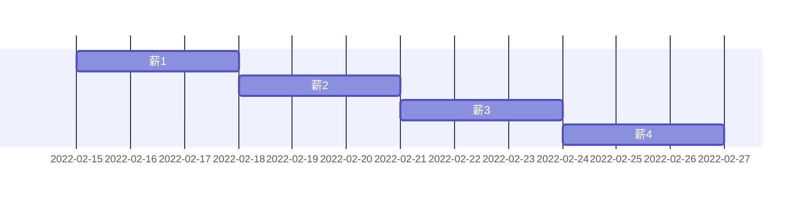

# 木こり
- 薪便利スクリプト集

## 特殊マークダウン記法忘備録

### 数式
$$
y = \sin(x)
$$

### 金沢駅
```geojson
{
  "type": "FeatureCollection",
  "features": [
    {
      "type": "Feature",
      "id": 1,
      "properties": {
        "ID": 0
      },
      "geometry": {
        "type": "Polygon",
        "coordinates": [
            [
              [136.64563179016113, 36.576421223873226],
              [136.64999842643735, 36.576421223873226],
              [136.64999842643735, 36.580048444699784],
              [136.64563179016113, 36.580048444699784],
              [136.64563179016113, 36.576421223873226]
            ]
        ]
      }
    }
  ]
}
```


### 薪todo



## Actionsから静的htmlを作成するテスト
- [テストページ](https://matsui528.github.io/kikori/fuga.html)。この内容はActionsで自動生成されている。[pages.yml](https://github.com/matsui528/kikori/blob/main/.github/workflows/pages.yml)を参考。
- [html以外もおける](https://matsui528.github.io/kikori/piyo.txt)
- [公式のここ](https://docs.github.com/en/pages/getting-started-with-github-pages/configuring-a-publishing-source-for-your-github-pages-site#publishing-with-a-custom-github-actions-workflow)を参考にする。
- ディレクトリを指定する必要がある

## Actionsの結果表示画面にマークダウンで作る
- [記事](https://github.blog/2022-05-09-supercharging-github-actions-with-job-summaries/)
- [ドキュメント](https://docs.github.com/en/actions/using-workflows/workflow-commands-for-github-actions#adding-a-job-summary)
- [このように書くと](https://github.com/matsui528/kikori/blob/main/.github/workflows/job_summary.yml)、[このようになる](https://github.com/matsui528/kikori/actions/runs/2879841508)

## ランダムソート
発表順番を決めるときとか

```python
import numpy as np
name = ["ゾロアット", "ドムットリア", "アビゴル", "ザンネック", "ガルグイユ"]
rng = np.random.default_rng(seed=123)
rng.shuffle(name)
print(name)
```

実行例
```console
$ python sort_name.py 
['ガルグイユ', 'ゾロアット', 'アビゴル', 'ザンネック', 'ドムットリア']
```

## 人間のアサインを決める
N人の人間をM個のスロットに配置したい。ここでそれぞれの予定を聞き、一番無理がないように配置する
- [座長配置問題](https://github.com/matsui528/zatyou)

## 論文の文献情報管理
- [CSVでまとめて管理し、必要に応じてレンダリング](https://github.com/matsui528/timberpile)
