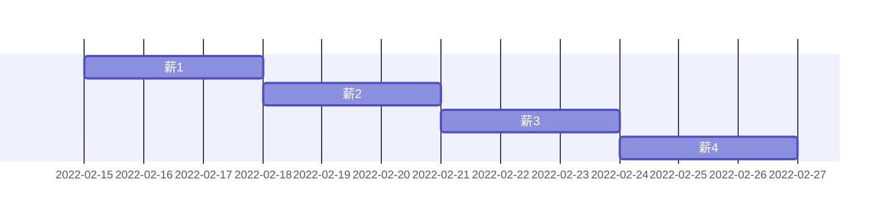

# 木こり
- 薪便利スクリプト集

## 特殊マークダウン記法忘備録

### 金沢駅
```geojson
{
  "type": "FeatureCollection",
  "features": [
    {
      "type": "Feature",
      "id": 1,
      "properties": {
        "ID": 0
      },
      "geometry": {
        "type": "Polygon",
        "coordinates": [
            [
              [136.64563179016113, 36.576421223873226],
              [136.64999842643735, 36.576421223873226],
              [136.64999842643735, 36.580048444699784],
              [136.64563179016113, 36.580048444699784],
              [136.64563179016113, 36.576421223873226]
            ]
        ]
      }
    }
  ]
}
```


### 薪todo



## ランダムソート
発表順番を決めるときとか

```python
import numpy as np
name = ["ゾロアット", "ドムットリア", "アビゴル", "ザンネック", "ガルグイユ"]
rng = np.random.default_rng(seed=123)
rng.shuffle(name)
print(name)
```

実行例
```console
$ python sort_name.py 
['ガルグイユ', 'ゾロアット', 'アビゴル', 'ザンネック', 'ドムットリア']
```

## 人間のアサインを決める
N人の人間をM個のスロットに配置したい。ここでそれぞれの予定を聞き、一番無理がないように配置する
- [座長配置問題](https://github.com/matsui528/zatyou)
